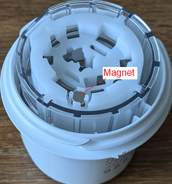

## G7, One+ or Stelo troubleshooting  
[xDrip](../../README.md) >> [Features](../Features_page.md) >> [xDrip & Dexcom](../Dexcom_page.md) >> Dexcom G7, One+ or Stelo troubleshooting  
   
  
#### [Applicator problems](./G7ApplicatorFailures.md)  
   
   
  
If you have inserted the sensor and no app or device is connected, but the xDrip status page continues to show “Hunting Transmitter” after waiting more than 15 minutes, try the following:  

Use a [scanner](../Bluetooth-Scanner.html) to see if it can detect the transmitter.  
If it does, and xDrip does not work, please try Dexcom app and [let us know](../Contact.html).  

If the scanner does not show the device, use the applicator and bring it close to the sensor so that the magnet on the applicator (shown in the image below) is near the sensor for a few seconds.  
  
   
   
  
If you see "Mismatch" on the status page, it means either your pairing code is wrong or there is another sensor nearby. Check that pairing code is correct and wait for connection.  
  
