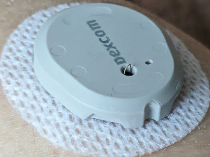
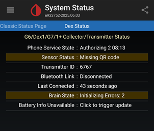
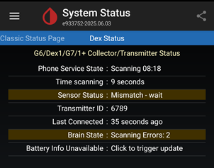
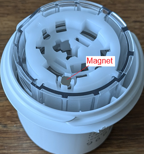
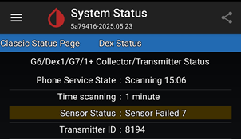

## G7, One+ or Stelo Troubleshooting  
[xDrip](../../README.md) >> [Features](../Features_page.md) >> [xDrip & Dexcom](../Dexcom_page.md) >> Dexcom G7, One+ or Stelo troubleshooting  
   
  
If you are using xDrip to directly collect readigns from G7, but are not receiving data, follow these steps in order:  
  
1- Disable [Engineering mode](../Engineering-Mode.md).  
  
2- Uninstall Dexcom app or any other app that connects directly to G7.  
  
3- Check the Sensor.  Do you see the filament protruding from the top?  
  
If yes, take a picture for reference to show Dexcom.  Even if connectivity is established, the sensor is unlikely to work since the filament has not been inserted under your skin.  You will need to use a new sensor.  
   
  
4- "Missing QR Code" on [Dex Status Page](../StatusG5G6.md)  
  
Use "Settings" > "Auto Config" to [scan](../Settings/Scan_QR_Code.md) the QR code shown in the [Guide](./G7.md), not on the sensor.  
Tap on “Restart Collector” on the Classic Status Page.  
   
  
5- “Mismatch - wait” on Dex Status Page  
  
- You may have entered the pairing code incorrectly or have old, used sensors nearby.  
- Move all previously used devices more than 10 meters away.  
- Ensure the pairing code is entered correctly—it is printed on the applicator.  
- Tap on “Restart Collector” on the Classic Status Page.  
   
  
6- Verify [proper connectivity](../Proper-connectivity.md).  
If there is no connectivity, [use a scanner to check if you can see the transmitter](../Bluetooth-Scanner.md).  
Move all previously used devices more than 10 meters away.  
  
- If you have moved all the old devices away and can see the transmitter in the scanner, verify that all [settings are correct](../G6-Recommended-Settings.md).  
  
- If the transmitter is not visible in the scanner, bring the applicator close to the sensor so the magnet (shown in the image below) is near the sensor for a few seconds.  
  
This may trigger the sensor to activate.  Check if the transmitter appears in the scanner.  
  
Tap on "Restart Collector" on the classic status page.  
   
  
7- Resolve "Deep Sleeping Errors," "Checking Auth Errors," or "Initializing Errors" on the Dex status page.  
- [Disable collection in xDrip](../Stop-xDrip.md).  
- If you use a pump or watch that connects directly to G7, temporarily disable them.  
- Wait 15 minutes for G7 to enter rapid reconnect mode.  
- Delete any devices whose names start with DXCM, DX01, or DX02 from the list of connected or previously connected Bluetooth devices.  
- Re-enable the xDrip Dex Collector by selecting Dex as the hardware data source.  
- Go to the Dex status page, wait up to a minute for a pairing request, and approve it.  
   
  
8- "Sensor Failed 7" on Dex Status Page  
  
- Avoid  lying down on the sensor.  
- Relax the limb where the sensor is placed.  
- Stay hydrated.  
- It may take up to 3 hours for readings to return.  
   
  
---  
  
If you receive readings but experience random disconnections, please refer to this [link](../Intermittent.md) for further guidance on stabilizing the connection.  
  
