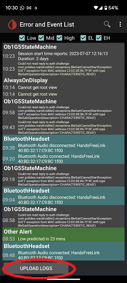

## OB1 collector debugging
[xDrip](../../README.md) >> [Features](../Features_page.md) >> [xDrip & Dexcom](../Dexcom_page.md) >> OB1 debugging  
  
[Reference](https://github.com/NightscoutFoundation/xDrip/wiki/Enabling-Debugging-for-OB1-collector)  
  
Enabling this will expand the type of logs generated.  This can help the developers troubleshoot your setup.  
   
  
---  

#### **Enable**  
To enable, use xDrip [auto configure](../FAQ/AutoConfig.md) to scan this QR code:  
  
  
After that, if you view the [logs](../Logs.md), you will see a lot more logs generated per minute.  
It will be pointless to upload the logs as soon as you have enabled the OB1 collector debugging.  You need to wait for the problem to occur.  Then, you can upload the logs.  
   

---  

#### **Upload**  
To do that, tap on `UPLOAD LOGS` at the bottom of the logs screen.  
  

Enter a note to identify the device and refer to it when you [inform us](https://github.com/NightscoutFoundation/xDrip/discussions) that you have uploaded the logs.  
   

---  

#### **Disable**  
To disable detailed logs, go to `Settings` &#8722;> `Less common settings` &#8722;> `Extra Logging Settings` &#8722;> `Extra tags for logging`.  
Delete the content and click on `OK`.  
  
  
