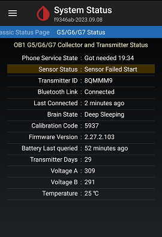
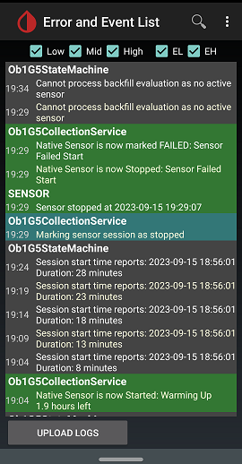

## Sensor failed start  
[xDrip](../../README.md) >> [Features](../Features_page.md) >> [xDrip & Dexcom](../Dexcom_page.md) >> Sensor failed start  
  
If you start sensor without keeping the transmitter detached for at least 10 minutes, the session you start will stop in about half an hour.  
You will then see the following on the status page and in the logs.  
  

  
   
  
1- Ensure there is no [connectivity problem](../Proper-connectivity.md).  
2- Perform a [restart](../Restart-G6-sensor.md).  
3- Next time, follow these [instructions](./StartG6Sensor.md) to avoid experiencing this problem again.  

  
