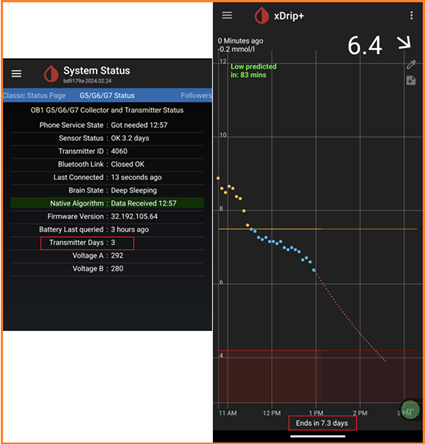

# Starting a subsequent G7 or One+  
[xDrip](../../) >> [Features](../Features_page.md) >> [xDrip & Dexcom](../Dexcom_page.md) >> Starting a subsequent Dexcom G7 or One+  
  
This guide outlines the recommended steps for starting your next device after you’ve already been using one.  
If you are starting a G7 or One+ for the first time, refer to the instructions [here](./G7.md).  
   
  
---  
  
#### **Starting a New Device**  
When the status page shows 10 days for transmitter days, or when the optional sensor-expiry notification on the main screen indicates the sensor will expire in about 12 hours, insert a new sensor following the “Starting the Sensor” section [here](./G7.md).  
  
  
You can use a secondary phone (different from your primary xDrip phone) or a [variant](../Variants.md) to establish connectivity with your new device and verify that it is functioning correctly. To do this, follow the instructions under “Establishing Connectivity” [here](./G7.md) using the secondary phone.  If you are using a variant on the same phone that is currently connected to your old sensor via the main xDrip app, follow the same instructions—except **do not delete the Bluetooth devices** from the list.  
  
Once you’ve confirmed the new device is working, you can [disconnect the secondary phone or variant](../Stop-xDrip.md).  There is no requirement to maintain connectivity for the sensor to remain operational.  
   
  
---  
  
#### **Transitioning to the New Device**  
When your current sensor stops working (after its 10.5-day period ends or earlier), proceed with the following steps:  

1- If you haven’t already disabled the secondary phone (or variant), do so now by disabling collection on it.  Wait 15 minutes.  
2- Carefully peel off the old sensor without accidentally removing the new one.  Store the old sensor inside a metallic box or move it at least 10 meters away to avoid interference.  
3- On your main phone, follow the instructions under the heading “Establishing Connectivity” [here](./G7.md) to connect to your new device using the pairing code of your new G7.  
   
  
---  
  
#### **Overlapping Sensors**  
You don’t have to wait until your current sensor reaches day 10 to insert a new one. If needed, you can start your next sensor while your current sensor still has a few days remaining.  
Keep in mind:  
- If the overlap between two sensors is 12 hours, 10 sensors will last 100.5 days.
- However, if you overlap by 1.5 days for each sensor, you will only get 91.5 days from the same 10 sensors.  
  
