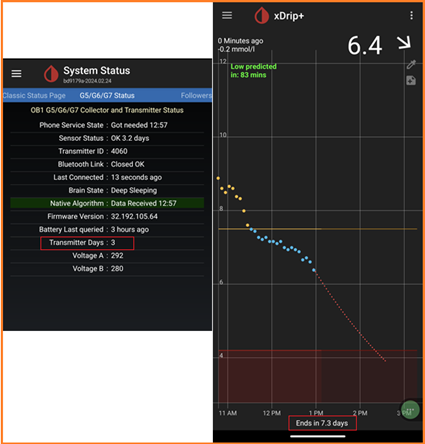

# Starting a subsequent G7 or One+  
[xDrip](../../) >> [Features](../Features_page.md) >> [xDrip & Dexcom](../Dexcom_page.md) >> Starting a subsequent Dexcom G7 or One+  
  
This guide outlines the recommended steps for starting a new sensor when you are already wearing an active one.  
If you are starting a G7 or One+ for the first time, please refer to the initial setup instructions [here](./G7.md).  
   
  
---  
  
#### **Starting a new sensor while the old one is still active**  
When the status page shows 10 "transmitter days," or when the optional sensor-expiry note on the main screen indicates the sensor will expire in approximately 12 hours, you can insert your new sensor.  Follow the “Starting the sensor” section [here](./G7.md).  
  
Note: This should occur at the 10-day mark, rather than waiting for the full 10.5-day limit (the end of the grace period), to allow for a smooth overlap.    
  
   
  
#### **New sensor verification**  
You can use a secondary phone or an [xDrip variant](../Variants.md) on the same phone to establish connectivity with your new sensor and verify that it is functioning correctly. To do this, follow the “Establishing Connectivity” instructions [here](./G7.md) using the secondary phone.  If you are using a variant on the same phone that is currently connected to your old sensor via the main xDrip app, follow the same instructions—except **do not delete the Bluetooth devices** from the Bluetooth list.  
  
Once you’ve confirmed the new sensor is operational, you can [disconnect the secondary phone or variant](../Stop-xDrip.md).  
   
  
---  
  
#### **Switching to the new sensor**  
When your current sensor stops working (after its 10.5-day period ends or earlier), proceed with the following steps:  

1- If you haven’t already disabled the secondary phone (or variant), do so now by disabling collection on it.  Wait 15 minutes for G7 rapid reconnect mode to start.  
2- Carefully peel off the old sensor without accidentally disturbing the new one.  Store the old sensor inside a metallic box or move it at least 10 meters away from your phone to avoid interference.  
3- On your main phone, follow the instructions under the heading “Establishing connectivity” [here](./G7.md) to connect to your new device using the pairing code of your new G7.  
  
