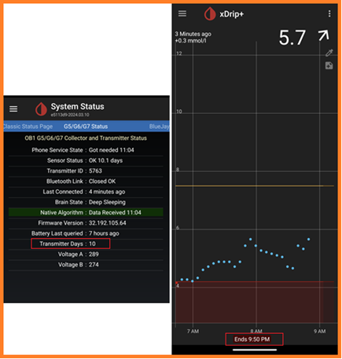

## Starting a subsequent G7 or One+  
[xDrip](../../README.md) >> [Features](../Features_page.md) >> [xDrip & Dexcom](../Dexcom_page.md) >> Starting a subsequent Dexcom G7 or One+  
  
This is the recommended approach for starting your next device after you have been using one already.  
If you want to start a G7 or One+ for the first time, the instructions are [here](./G7.md).  
  
When the status page shows 10 days for transmitter days, or after the optional sensor expiry note on the main screen shows that the sensor will expire in about 12 hours, insert a new sensor following the section titled "Starting the sensor" [here](./G7.md).  
  
  
You can use a phone, other than your main xDrip phone, to establish connectivity to your new device to confirm that it is working.  To do that, follow the instructions under the heading "Establishing Connectivity" [here](./G7.md) using the other phone.  
After you have confirmed that it is working, you can just [disconnect](../Stop-xDrip.md).  There is no requirement to maintain connectivity for a sensor to remain operational.  
  
When your current sensor stops working after its 10.5 day period ends, or before, proceed with the following.  
  
1- If you haven't disabled the test phone, do it now.  You can [disable collection](../Stop-xDrip.md) on it.  Wait 15 minutes.  
2- On your main phone, follow the instructions under the heading "Establishing Connectivity" [here](./G7.md) to connect to your new device using the pairing code of your new G7.  
3- Peel off the old sensor being careful not to accidentally peel off the new one.  
   
  
You don't have to wait for your current sensor to reach day 10 to insert a new one.  If you need to, you can start your next sensor when your current sensor still has less than 10 days on it.  In that case, the overlap between the two sensors will be more than 12 hours.  
If you have 10 sensors and you overlap each for 12 hours, you will get 100.5 days from them.  But, if you overlap them by 1.5 days each, you will only get 91.5 days from the 10 sensors instead of 100.5.  
  
