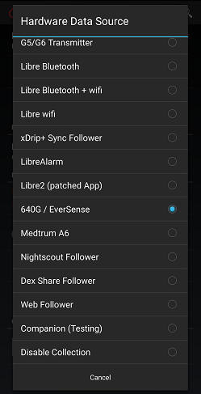

## Dexcom app to xDrip  
[xDrip](../README.md) >> [Features](./Features_page) >> [Follow](./Follow_page.md) >> [How to follow with xDrip](./How-to-follow.md) >> [Dexcom app](./DexcomAppxDrip.md)  
  
If you have to use the Dexcom app as your collector and want to use xDrip as a follower, if you run both on the same phone, you can use local broadcast to not have to need WiFi or data.  
  
Instead of the Dexcom app, you will need to use the [Build your own Dexcom app](https://docs.google.com/forms/d/e/1FAIpQLScD76G0Y-BlL4tZljaFkjlwuqhT83QlFM5v6ZEfO7gCU98iJQ/viewform?fbzx=2196386787609383750&fbclid=IwAR2aL8Cps1s6W8apUVK-gOqgGpA-McMPJj9Y8emf_P0-_gAsmJs6QwAY-o0)  
Uninstall the Dexcom app if you have it or any version of it installed.  Then, download and install the BYODA that you created.  
    
In xDrip, running on the same phone, choose Settings &#8722;> Hardware Data Source &#8722;> 640G / EverSense.  
  
  
Tap on start sensor and enter the time for 2 hours ago.  It will not interfere with the sensor running in the Dexcom app.  But, you should now have readings in xDrip.  
  
