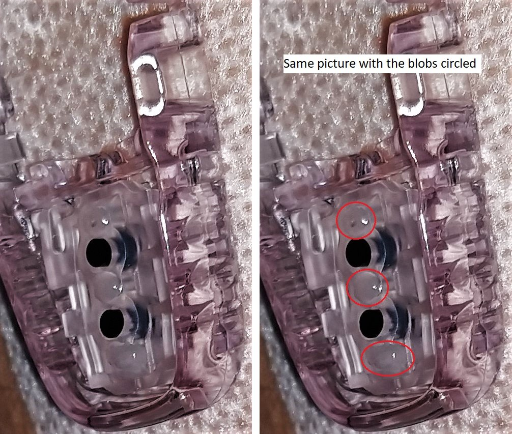

## Petroleum Jelly in Dexcom G6 Sensor  
  
After inserting the sensor and before snapping in the transmitter, you can see small blobs of petroleum jelly inside the sensor around the contacts.  
Don't wipe them off. Don't let dust or any other material get into it.  

You should wait a minute or two to make sure there is no bleeding. If there is, use Q-tips to absorb the blood and keep doing it until bleeding stops. If blood gets into the contacts, it could compromise the insulation of the two contacts resulting in erroneous low readings.  

After cleaning the transmitter contacts (not the sensor) snap in the transmitter. Doing so causes the gel to spread around the contacts. It provides a barrier, against moisture, around the contacts.  

In order to [restart](./Restart-G6-sensor.md) a G6 sensor, we remove the transmitter and later snap it back in. When doing that, don't wipe away the substance from the transmitter contacts. While the transmitter is out, cover the transmitter and sensor to protect the substance from contaminants like dust or being accidentally wiped away by your clothes.  

  
