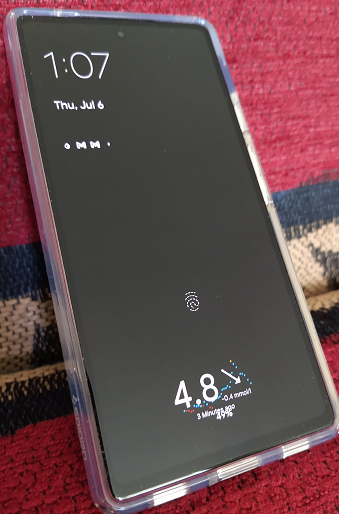
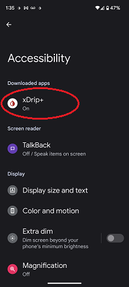
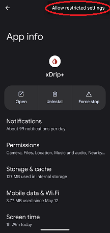
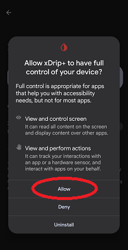

## Always-on Display
[xDrip](../../README.md) >> [Features](../Features_page.md) >> [Display](./Display.md) >> Always-on display    
  
If your phone has [always-on display](https://en.wikipedia.org/wiki/Always-on_display), you can set it up to show the xDrip widget on the screen when the phone is sleep.  

  

To set up, access Settings &#8722;> xDrip+ Display Settings &#8722;> Enable xDrip Accessibility.  
It will take you to the Android accessibility menu.  Tap on xDrip to enable as shown below.  
  

If doing that does not allow you to enable it, go to xDrip app info under Android settings and from the 3-dot menu at the top right, select "Allow restricted settings".  
  
  
Approve the confirmation request.  
  

Now, repeat the process.  This time, you will be able to choose xDrip to be used for AOD on the accessibility page.  
  
