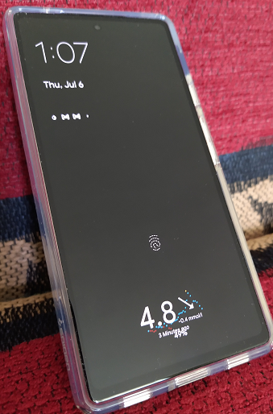
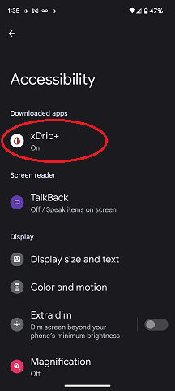
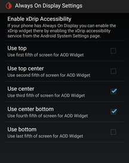

## Always-on Display
[xDrip](../../README.md) >> [Features](../Features_page.md) >> [Display](./Display.md) >> xDrip Always-on display    
  
If your phone supports an always-on display (AOD), you can configure it to show the xDrip widget on the screen while the phone is in sleep mode.  

  

**How to Set It Up:**  

1- Go to `Settings` &#8722;> `xDrip+ Display Settings` &#8722;> `Always-On Display Settings` &#8722;> `Enable xDrip Accessibility`.  

This will take you to the Android Accessibility menu. Tap on xDrip to enable it, as shown below.  
  

2- If you're unable to enable it:  
- Navigate to xDrip app info under Android Settings.  
- From the 3-dot menu at the top right, select `Allow restricted settings`.  

3- Approve the confirmation request.  
  

Repeat the setup process. This time, you should be able to enable xDrip for AOD from the Accessibility menu.  
   
  
**Widget Behavior:**  
By default, the widget will move around the display to prevent screen burn-in.  

To restrict its movement to specific areas:  

- Go to `Settings` &#8722;> `xDrip+ Display Settings` &#8722;> `Always-On Display Settings`.  
- Select the desired regions for the widget.
    

If you select `All` or `None`, the widget will continue to move across the entire screen, which is the default behavior.  
   
  
---  

#### **Reference**  
[xDrip issue](https://github.com/NightscoutFoundation/xDrip/issues/1625#issuecomment-770098141)  

  
