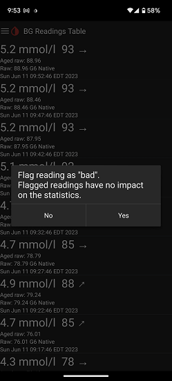

## Exclude a reading
[xDrip](../../README.md) >> [Features](../Features_page.md) >> [Display](./Display.md) >> Exclude an xDrip reading - mark a reading as bad - bad reading  
  
You can mark a reading, in xDrip, as a bad reading and exclude it from xDrip statistics.  
  
To do that, you will need to use the [data table](../Datatables.md).  Open the readings data table.  Find the reading.  Long press it.  You will see a prompt to flag the reading as bad.  
  
  
Answer with "yes".  
After you flag a reading as bad, the color of the point representing the reading on the main screen will change and the reading will be excluded from xDrip statistics.  
Also, the marked reading will be highlighted in the data table.  
  
You can undo this by using the data table again.  Go to the data table.  Long press the reading you want to unmark.  In response to the prompt that comes up, choose "no" to unmark the reading.  It will become a normal reading again.  
   

Please note that marking a reading as bad will not exclude it from being uploaded to Nightscout or Tidepool.  
  
#### **Glucose range**  
If you have had a very high reading, xDrip will adjust the vertical, y, axis so that the reading will be visible, ignoring your chosen vertical axis range.  
  
If the reading was in error, and you mark it as bad, xDrip will avoid adjusting the range to include it on screen.  
  
