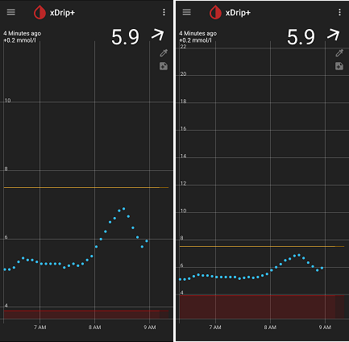

## Glucose y (vertical) axis range
[xDrip](../../README.md) >> [Features](../Features_page.md) >> [Display](./Display.md) >> Glucose range  
  
You can adjust the range shown on screen as long as you have no readings that go outside the range.  If you do, the range will extend to show such readings for several hours.  
   
  
---  
  
#### **Warning**  
If you reduce the range dramatically and get used to the way your variations look on screen, and one day you end up with an unusual high, the range shown on screen will automatically expand significantly for you.  
This expanded change will last 24 hours.  During those 24 hours, your screen will show curves with much less ups and dows due to the significant change in range.  
Please be careful.  
  
The following image shows the exact same results at the two extremes.  
  
   
  
---  
  
#### **How**  
You can access the setting at:  
Settings &#8722;> xDrip+ Display Settings &#8722;> Graph Settings &#8722;> Customize y axis range  
  
Enable the feature.  When you do, two settings, on the same page, become available allowing you to adjust Y Min and Y Max.  
Adjusting either will take effect imidiately on screen.  
  
If you disable the feature after, the range will go back to default, but, the settings will not be erased.  So, if you reenable, the settings you had chosen previously will take effect again.  
  
  
