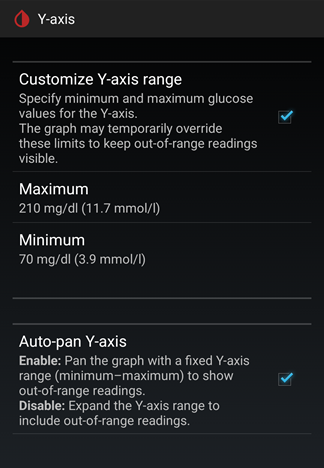
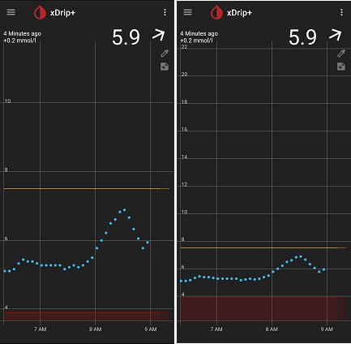

# Glucose Y (vertical) axis
[xDrip](../../) >> [Features](../Features_page.md) >> [Display](./Display.md) >> Glucose axis  
  
You can adjust the glucose range shown on screen as long as no readings fall outside that range.  If a reading exceeds the configured limits, depending on the setting explained below, the graph will automatically pan or temporarily expand the range to keep the latest readings visible.  
   
  
---  
  
#### **How**  
You can access this setting at:  
`Settings` &#8722;> `xDrip+ Display Settings` &#8722;> `Graph Settings` &#8722;> `Y-axis`  
  
    
  
When "Customize Y-axis range" is enabled, two additional settings on the same page become available, allowing you to adjust Minimum and Maximum limits.  
Changes take effect immediately on the graph.  
  
If you later disable the feature, the graph returns to the default range, but your custom values are not erased. Re-enabling the feature restores the previously selected settings.  
   
  
---  
  
#### **Warning**  
If you significantly reduce the range and do not enable Auto-pan, and a high reading occurs, xDrip will automatically expand the range.  
This expanded range will last for 24 hours and cannot be changed during that time. During those 24 hours, the graph will appear much flatter, with fewer visible ups and downs, due to the significantly expanded range.  
  
The following image shows the exact same readings displayed at the two extremes of the Y-axis range.  
  
  
Be careful not to overlook variations if the range expands due to very high readings.  
   
  
---  
  
#### **Auto-pan**
You can enable Auto-pan to avoid range expansion when high readings occur. Instead, auto-pan shifts the view to keep high readings visible. This preserves the visual appearance of variations as they appeared before.  
  
