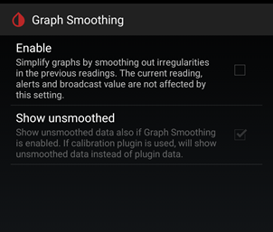

## Graph Smoothing  
[xDrip](../../README.md) >> [Features](../Features_page.md) >> [Display](./Display.md) >> [Graph smoothing](./GraphSmoothing.md)  
  
You can enable a low-pass filter to reduce the transients.  
It is impossible to have a low-pass filter that does not cause delay.  
To enable the filter, enable:  
Settings &#8722;> xDrip+ Display Settings &#8722;> Graph Settings &#8722;> Graph Smoothing  
  
