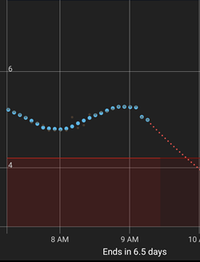
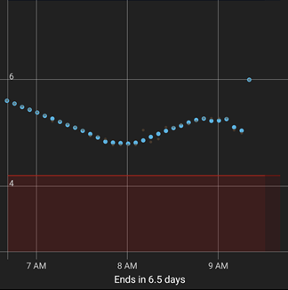
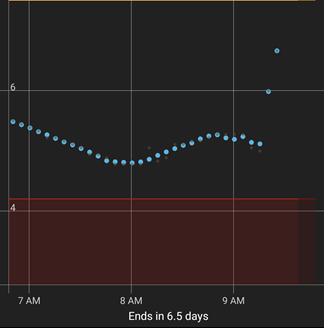
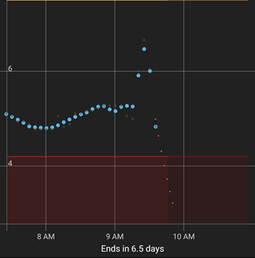
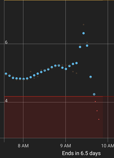
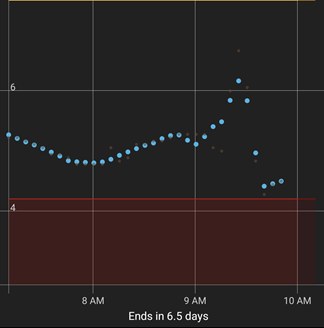
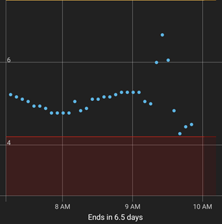

## Graph Smoothing  
[xDrip](../../README.md) >> [Features](../Features_page.md) >> [Display](./Display.md) >> Graph smoothing  
  
You can enable a low-pass filter to reduce transients. It is important to note that a low-pass filter will always introduce some degree of delay. Applying this filter to all data, including the current reading, would cause undesirable delays. Therefore, the filter is only applied to older readings and does not affect the current or recent readings. Consequently, it does not impact alert triggers or the data broadcast to Nightscout or AAPS.   
  
To enable the filter, navigate to:   
`Settings` &#8722;> `xDrip+ Display Settings` &#8722;> `Graph Settings` &#8722;> `Graph Smoothing` &#8722;> `Enable`  
  
  
After enabling graph smoothing, you can also view the unfiltered readings if desired. To do this, enable: `Settings` &#8722;> `xDrip+ Display Settings` &#8722;> `Graph Settings` &#8722;> `Graph Smoothing` &#8722;> `Show unsmoothed`.  
   

---  

#### **What it does**  
This setting effectively rewrites the history displayed on your screen without altering the broadcast data. The images below illustrate a sequence of snapshots of the main screen with graph smoothing enabled, showing both smoothed and unsmoothed points.   

  

  

  

  

  

  

  
  
For example, at the reading recorded at 9:15, you can observe that the smoothed reading deviates more from the original unsmoothed value with each sequence.  
  
The following image shows the same results at the same time as the last image, but with graph smoothing disabled, which is what AAPS receives whether you enable the setting or not.  
    
  
Enable this setting if you want the graph on your screen to appear smoother.  
  
