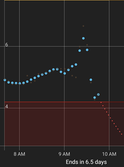

## Graph Smoothing  
[xDrip](../../README.md) >> [Features](../Features_page.md) >> [Display](./Display.md) >> Graph smoothing  
  
You can enable a low-pass filter to reduce the transients.  
It is impossible to have a low-pass filter that does not cause delay.  If this was applied to all data, including the current reading, it would add a delay, which would be very bad.  It is only applied to older readings.  It does not affect the current or the recent readings.  Therefore, it does not affect the alert triggers.  Neither does it affect the data broadcast to Nightscout or AAPS.  
  
To enable the filter, enable:  
`Settings` &#8722;> `xDrip+ Display Settings` &#8722;> `Graph Settings` &#8722;> `Graph Smoothing` &#8722;> `Enable`  
  
  
After you enable graph smoothing, you can also see the unfiltered readings if you want.  For that, enable `Settings` &#8722;> `xDrip+ Display Settings` &#8722;> `Graph Settings` &#8722;> `Graph Smoothing` &#8722;> `Show unsmoothed`.  
   

---  

#### **What it does**  
This setting effectively rewrites history on your screen, not the broadcast data.  
The following images show a sequence of snapshots of the main screen with the graph smoothing setting enabled and the unsmoothed points shown as well.  

  

  

  

  

  

  

  

If you focus on the reading at 9:15, you can see that the reading deviates from the original, unsmoothed, value more and more at every sequence.  

The following image shows the same results exactly at the same time as the last image, but with graph smoothing disabled.    
  
You can see the original readings before being made pretty.  
Enable the setting if you want the graph on your screen to look pretty.  
  
