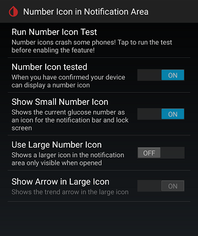
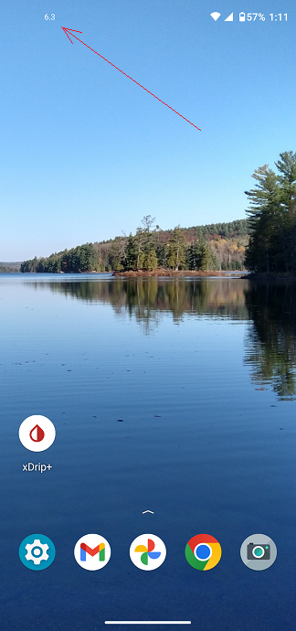

## Number Icon in Notification Area
[xDrip](../../README.md) >> [Features](../Features_page) >> [Display](./Display) >> Number icon in notification area  
  
On some phones, you can show the glucose reading in the notification area, even when xDrip is minimized.  
To set this up, go to Settings &#8722;> xDrip+ Display Settings &#8722;> Number icon in Notification Area.  
  
  
On that page, test it first.  Enable "Number Icon tested".  
Enable "Show small number icon".  
  
After you restart the phone, you should see the new reading as shown below.  
  
  
  
