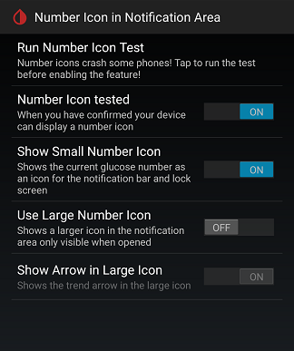
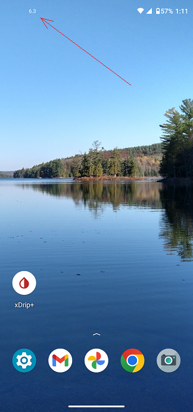

# Number Icon in Notification Area
[xDrip](../../) >> [Features](../Features_page.md) >> [Display](./Display.md) >> Number icon in notification area  
  
On certain phones, you can display the glucose reading in the notification area, even when xDrip is minimized.  
To enable this feature, navigate to:  
`Settings` &#8722;> `xDrip+ Display Settings` &#8722;> `Number icon in Notification Area`.  
  
  
1- Test the feature.  
2- Enable `Number Icon Tested`.  
3- Enable `Show Small Number Icon`.   
  
After restarting your phone, the glucose reading should appear in the notification area, as shown below.   
  
  
---  
  
#### **Hidden setting**
Make sure the following Android setting is disabled:  

Android Settings → Notifications → Hide silent notifications in status bar  
  
