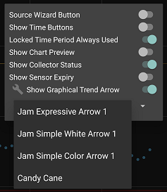
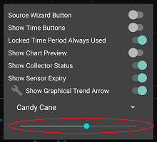

## Trend Arrow
[xDrip](../../README.md) >> [Features](../Features_page.md) >> [Display](./Display.md) >> xDrip Trend Arrow  
  
The xDrip trend arrow is displayed on the main screen to the right of the current reading.  The direction of the arrow indicates the difference between the current reading and the previous one.  You can customize the trend arrow.  
  
To customize the trend arrow, open the [home shelf](../HomeShelf.md) and tap on the wrench symbol.  
  
Now, you can use the dropdown menu that appears below to select various options for the trend arrow.  
  
  
For color arrows, you can also adjust the color using a slider.  
  
  
