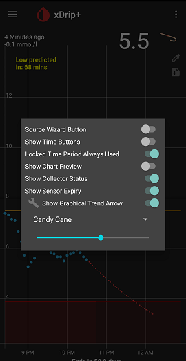

## Trend Arrow
[xDrip](../../README.md) >> [Features](../Features_page) >> [Display](./Display) >> [Trend Arrow](./TrendArrow)  
  
The trend arrow is shown on the main screen on the right beside the current reading.  The direction of the arrow represents the difference between the current reading and the previous.  
You can customize the trend arrow.  
  
To customize the trend arrow, long press the xDrip icon on the main screen to bring up the home shelf menu.  Enable "Show Graphical Trend Arrow".  
  
Tap on the wrench symbol.  
  
Now, you can use the drop down menu that appears below to select several options for the trend arrow.  For color arrows, you can also adjust the color using a slider.    
