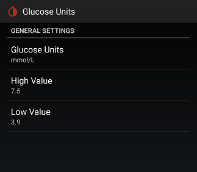

## Blood glucose units
[xDrip](../../README.md) >> [Features](../Features_page.md) >> [Display](./Display.md) >> xDrip Blood glucose units  
  
Blood glucose is measured with two different units depending on where you live.  
You can set xDrip to use the unit of your choice at Settings &#8722;> Glucose Units.  
  
  
