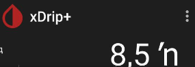

## Wrong Trend Arrow Symbol  
[xDrip](../../README.md) >> [Features](../Features_page.md) >> [Display](./Display.md) >> Wrong trend arrow symbol  
  
If you use an Infinix phone, you may see a wrong character for the trend arrow.  
  

Edit the trend arrow and choose a [graphical trend arrow](./TrendArrow.md).  That should fix the problem.  

