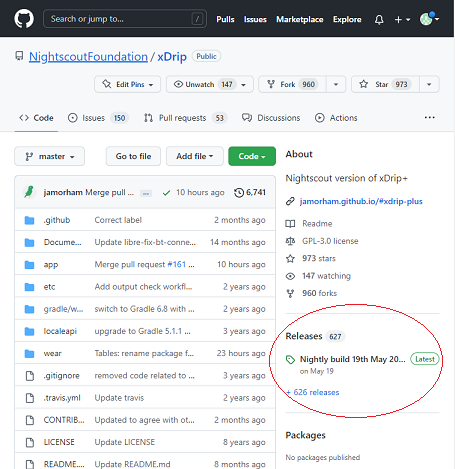

## Download xDrip  
  
You can download the latest stable version from "Latest" [here](https://github.com/NightscoutFoundation/xDrip/).  
  

On a mobile, you will need to scroll almost all the way down to reach Releases and "Latest".  

You can access the nightly builds (least tested but more recent) from "Releases" on the same page.  
On a mobile, you will need to scroll almost all the way down to reach Releases.  
  
Download the file with .apk at the end.  If there are multiple files with .apk at the end, download the one without "variant" included in the name.  
  
[Download & Installation](./Installation_page.md)  
  
