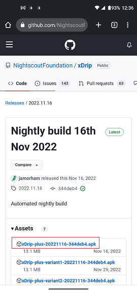

---  
title: Download xDrip  
description: "Instructions for downloading xDrip: where to get the stable and nightly APK builds and how to choose the correct file."  
---  
  
## Download xDrip  
[xDrip](../README.md) >> [Download & Installation](./Installation_page.md) >> Download xDrip  
   
  
#### **Stable Release**  
You can download the latest stable version from this [link](https://github.com/NightscoutFoundation/xDrip/releases/latest).    
   
   
  
---  
  
#### **Nightly Releases**  
You can access the nightly builds (least tested but more recent) from the `Release notes` on this [link](./ReleaseNotes.md).  
   
   
  
---  
  
#### **What to download**
After accessing the release you want, you will see something like this after expanding `Assets`:  
  
    
Download the file with .apk at the end.  If there are multiple files with .apk at the end, download the one without [`variant`](./Variants.md) included in the name.  
The file will be downloaded to the "Download" folder on your phone.  
   
  
---  
  
#### [Install](./Install.md)
#### [Updates](./Updates.md)
#### [Release Notes](./ReleaseNotes.md)
#### [xDrip is not in Google Play Store ...](./App-store.md)
