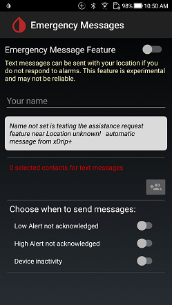

## Emergency Messages
[xDrip](../README.md) >> [Features](./Features_page.md) >> Emergency Message  
  
xDrip can send text messages when/if you need help.  
To enable and setup the capability, from the top right menu button, tap on "Emergency Messages".  
  
  
  
  
