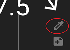
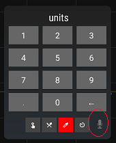

## Engineering Mode
[xDrip](../README.md) >> [Features](./Features_page.md) >> [Engineering mode](./Engineering-Mode.md)  

The functions that are not fully tested or are meant to be tested, or are meant to be used only in certain conditions that are not quite normal are only accessible in the engineering mode.  
No one should need to enable engineering mode under normal circumstances.  

**Enable**  
To enable engineering mode, tap on the dropper symbol on the main screen.  
.  

Then, long press on the microphone symbol at the bottom right corner of the form.  
  

Then, type "enable engineering mode" without the quotes.  

**Disable**  
To disable engineering mode, disable it on the page at Settings &#8722;> Less common settings &#8722;> Other misc options.  
  
[**Affected functions**](BehindEngineeringMode)  
  
