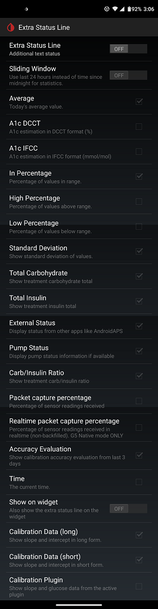

## Extra Status Line  
[xDrip](../README.md) >> [Features](./Features_page.md) >> [Display](./Display/Display.md) >> [Extra status line](./Extra-status-line.md)  
  
You can add and set up an extra status line on the main screen at Settings &#8722;> Less common settings &#8722;> Extra Status Line.  

For example, you can show today's average value on your extra status line.  
