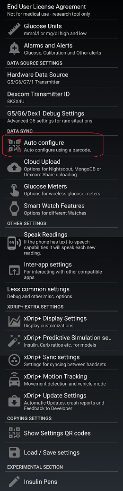

# Auto configure
[xDrip](../../) >> [FAQ](../FAQ_page.md) >> Where is Auto configure?  
  
Tap on the main menu at the top left corner of the main screen and choose `Settings`.  
You can see Auto configure as shown below.  
  

  

  

  
