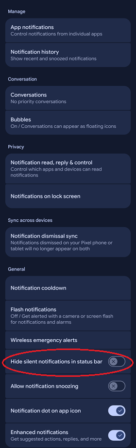

# Restore number icon in notification area
[xDrip](../../) >> [FAQ](../FAQ_page.md) >> Why Did number icon in notification area disappear?  
  
There is an Android setting that hides silent notifications from the status bar.  
Android settings > Notifications > Hide silent notifications in status bar  
  
The xDrip ongoing notification, which is used to display the number icon, is classified as a silent notification.  To ensure the icon remains visible, you should keep the Android "Hide silent notifications in status bar" setting disabled.  
   
  
---  
  
#### [Number icon in notification area](../Display/NumIconNotifArea.md)  
  
