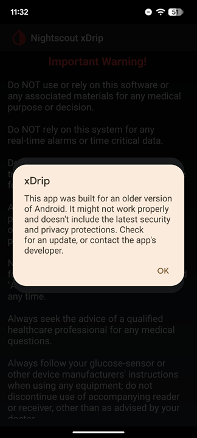

# xDrip was built for an older version of Android
[xDrip](../../) >> [FAQ](./images/FAQ_page.md) >> Why do I see this message?  
  
After installing xDrip, you may encounter the following message:    
  
This is an expected message. To remove this warning, we would have to update xDrip in a way that would prevent it from running on older smartphones.  

#### **Our philosophy**  
Diabetes affects everyone, not just those who can afford the newest flagship devices.  We are committed to ensuring xDrip remains accessible to as many people as possible.  By maintaining compatibility with older Android versions, we ensure that users aren't forced to upgrade their hardware just to manage their health.  

As a result, users on newer versions of Android will see this compatibility message during installation.  
  
#### **How to proceed**  
This warning does not mean the app is unsafe.  It is a standard Android notice regarding the software's target API level.  
Simply tap "OK" to dismiss the message.  xDrip will continue to function normally.  
Note: If you were blocked during the installation, please see the [Installation guide](../Install.md) for how to bypass the "Unsafe App" warning.  
  
  
