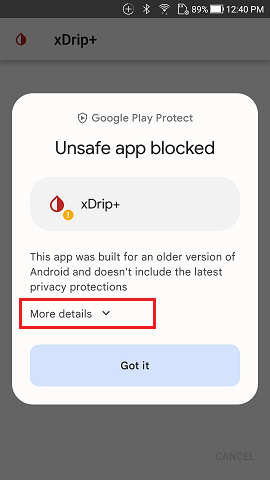
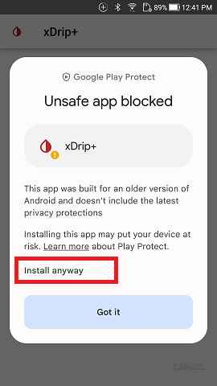

## Unsafe app blocked
[xDrip](../../README.md) >> [FAQ](../FAQ_page.md) >> Why Do I Get the "Unsafe App Blocked" Message?  
  
When attempting to install xDrip, you may encounter the following message:    
  
  
This is an expected security measure due to xDrip not being available on the Google Play Store. To proceed with the installation:  
- Tap on “More details”: This will expand additional options.  
  
  
- Tap on “Install anyway”: This allows you to continue with the installation despite the warning.  
  
   
  
Since xDrip is not listed in the Google Play Store, the installation screen prominently displays a “Got it” button, which will cancel the installation. This button is highlighted and centered to attract your attention.  
To install xDrip, make sure to select “More details” and then “Install anyway” as described above.  
  
---  
  
#### [Install xDrip](../Install.md)  
  
