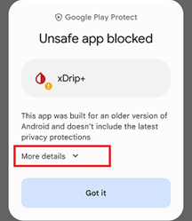
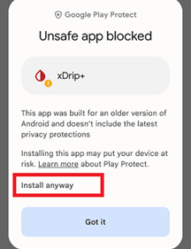

## Unsafe app blocked
[xDrip](../../README.md) >> [FAQ](../FAQ_page.md) >> Why do I get unsafe app blocked?  
  
Attempting to install xDrip, I get the following message.  
Unsafe app blocked  
  
  
This is expected.  Tap on “More details”. Now, you will see the following.  
  
  
Tap on “Install anyway”.  
   
  
---  
  
#### [Install xDrip](../Install.md)  
  
