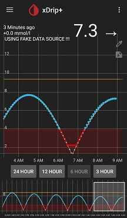

# Fake or Mock Data Source (Advanced)
[xDrip](../) >> [Features](./Features_page.md) >> Fake/Mock Data Source  
  
Have you ever wanted to test something in xDrip, but, didn't want to use a sensor for it?  
You can.  xDrip has a fake data source.  
  

Since it is meant for testing, you can only use it in [engineering mode](./Engineering-Mode.md).  
After enabling engineering mode, enter "enable fake data source" as a [voice command](./Settings/VoiceCommands.md) to enable the fake data source.  
   
  
---  

#### **Tweaks**  
You can control the fake data source as summarized in the following table.  

| Command | Effect | On-screen note | Notes |  
| ----------- | ------ | ------------------ | ---- |  
| Enable fake data source | def f and def Amp | Using fake data source!!! | |  
| Speed up fake data source | f = 3.3 X def f | Using fake data source!!! F | Must be enabled first |  
| Amplify fake data source | Amp = 3.3 X def Amp | Using fake data source!!! Amp | Must be enabled first |  
| Fake data source one minute  | One reading every minute | Using fake data source!!! | Must be enabled first |  
  
  
