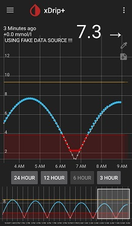

## Fake or Mock Data Source (Advanced)
[xDrip](../README.md) >> [Features](./Features_page.md) >> Fake/Mock Data Source  
  
Have you ever wanted to test something in xDrip, but, didn't want to use a sensor for it?  
You can.  xDrip has a fake data source.  
  

Since it is meant for testing, you can only use it in [engineering mode](./Engineering-Mode.md).  
After enabling engineering mode, enter "enable fake data source" as a [voice command](./Settings.md) to enable the fake data source.  
  
You can enter a voice command by tapping on the dropper symbol on the main screen and then tapping on the microphone symbol.  Or, you can type the command, instead of speaking it, by tapping on the dropper symbol and long pressing on the microphone symbol.  
   
  
---  

#### **Tweaks**  
You can control the fake data source as summarized in the following table.  

| Command | Effect | On-screen note | Note |  
| ----------- | ------ | ------------------ | ----- |  
| Enable fake data source | def f and def Amp | Using fake data source!!! | Enable |  
| Speed up fake data source | f = 3.3 X def f | Using fake data source!!! F | Subsequent to enable |  
| Amplify fake data source | Amp = 3.3 X def Amp | Using fake data source!!! Amp | Subsequent to enable |  
| Both (see note)  | f = 3.3 X def f   Amp = 3.3 X def Amp | Using fake data source!!! F Amp | If you issue the two subsequent commands one after the other |    
  
  
