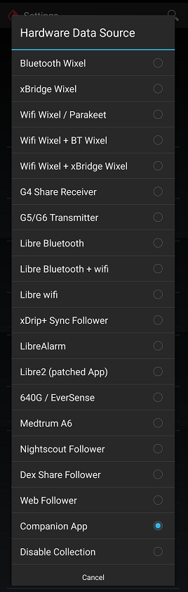

## Companion App
[xDrip](../../README.md) >> [Features](../Features_page.md) >> [Follow](../Follow_page.md) >> Companion App  
  
xDrip can get readings from notifications issued by another app.  
For example, if you have CamAPS installed and operational, you can have xDrip on the same phone show readings from CamAPS.  
Similarly, if you have a Dexcom app installed collecting from a transmitter, you can use the Companion App feature to receive readings from the Dexcom app.  

For this to work, you need to have notifications showing on your phone from the other app.  Pull down from the top of the screen on your phone to see all the notifications.  
If you have more than one app showing notifications containing blood glucose values, xDrip will have no way to distinguish and select one and not the other.  That scenario is not tested and not recommended.  
In such a case, you should disable the notifications of one of the two apps.  
  
This feature does not require internet access.  
  
To use it, enable Companion App on the Hardware Data Source page.  
  
  
  
