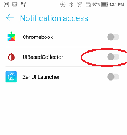
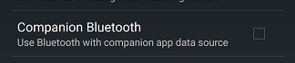

## Companion App Mode
[xDrip](../../README.md) >> [Features](../Features_page.md) >> xDrip Companion App mode  
  
xDrip can receive readings from notifications issued by another app. For example, if you have CamAPS installed and operational, you can have xDrip on the same phone display readings from CamAPS. Similarly, if you have the Dexcom app installed and collecting data from a transmitter, you can use the Companion App feature to receive readings from the Dexcom app. This feature does not require internet access.
  
  
  
1- Ensure that notifications from the other app are visible on your phone. Pull down from the top of the screen to view all notifications.  
  
2- Enable Companion App mode on the [Hardware Data Source page](../HardwareDataSource.md).  
  
3- Grant xDrip notification access. When you enable Companion App mode, you will be prompted to grant this permission to xDrip. If you did not grant permission at that time, you can do so later by following these steps:  
  
- Go to Android settings on your phone.  
- Search for "notification access." Android will locate and display the setting.  
- Tap on it and enable xDrip.  
   
  
4- Set xDrip to use the same [unit](../Display/Units_HiLow.md) for blood glucose as your companion app, either mmol/L or mg/dL.  
   
  
---  
  
#### **Backfill**  
When using Companion App mode, if you leave your phone for more than 5 minutes, you might see missing readings in xDrip upon your return, even if the companion app has no missed readings.  
  
Enable the following setting: If you return after more than 5 minutes and see no missed readings in xDrip, this is ideal.  
  
Please note that this feature may not work on all phones, Android versions, or companion apps. Test and use if it works for you.  
  
`Settings` &#8722;> `Less common settings` &#8722;> `Bluetooth Settings` &#8722;> `Companion Bluetooth`  
  
   
  
---  

#### **Multiple Companion apps**  
The Companion App feature is designed to work with only one companion app at a time. If you have two different apps that xDrip can work with as companion apps, xDrip cannot be configured to collect data from only one of them. Using such a setup is not recommended.  

If you need to use two different apps simultaneously and xDrip can collect data from both in Companion App mode, you should disable notifications in one of the apps.  
  
