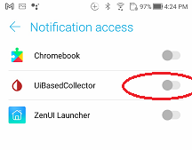

## Companion App Mode
[xDrip](../../README.md) >> [Features](../Features_page.md) >> [Follow](../Follow_page.md) >> xDrip Companion App mode  
  
xDrip can get readings from notifications issued by another app.  
For example, if you have CamAPS installed and operational, you can have xDrip on the same phone show readings from CamAPS.  
Similarly, if you have a Dexcom app installed collecting from a transmitter, you can use the Companion App feature to receive readings from the Dexcom app.  
This feature does not require internet access.  
  
1- You need to have notifications showing on your phone from the other app.  Pull down from the top of the screen on your phone to see all the notifications.  
  
2- Enable Companion App on the [Hardware Data Source page](../HardwareDataSource.md).  
  
3- Give xDrip notification access.  When you enable Companion app mode, you will be offered the opportunity to give that permission to xDrip.  If you didn't grant permission, this is how you can do it later.  
Go to Android settings on your phone.  Perform a search and search for notification access.  Android will find and show you the setting.  Tap on it.  Enable xDrip.  
  
  
4- Set xDrip to use the same [unit](../Display/Units_HiLow.md) for blood glucose that your companion app is set to, mmol/L or mg/dL.  
   
  
---  
  
#### **Backfill**  
When using companion app mode, if you walk away from your phone for more than 5 minutes, when you return, you will see missing readings in xDrip even though the companion app may have no missed readings.  
  
Enable the following setting.  If then, you walk away from the phone for more than 5 minutes and on your return, you see no missed readings in xDrip, perfect.  
  
Please note there is no guarantee this will work on all phones or Android versions or companion apps.  Please test and use if it works for you.  
  
`Settings` &#8722;> `Less common settings` &#8722;> `Bluetooth Settings` &#8722;> `Companion Bluetooth`  
  
   
  
---  

#### **Multiple Companion apps**  
The companion app feature is meant to be used with one companion app only.  
If you have two different apps that xDrip can work with as companion apps, xDrip has no way of being set to only collect from one.  
You are not supposed to use such a setup.  
If there is a requirement to use two different apps at the same time and xDrip can collect from both in companion app mode, you should disable notifications in one of the two apps.  
  
