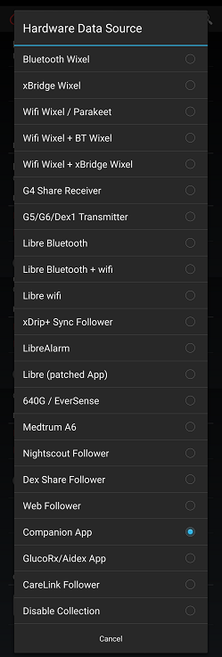

## Companion App
[xDrip](../../README.md) >> [Features](../Features_page.md) >> [Follow](../Follow_page.md) >> Companion App  
  
xDrip can get readings from notifications issued by another app.  
For example, if you have CamAPS installed and operational, you can have xDrip on the same phone show readings from CamAPS.  
Similarly, if you have a Dexcom app installed collecting from a transmitter, you can use the Companion App feature to receive readings from the Dexcom app.  
This feature does not require internet access.  
  
For this to work, you need to have notifications showing on your phone from the other app.  Pull down from the top of the screen on your phone to see all the notifications.  
If you have more than one app showing notifications containing blood glucose values, xDrip will have no way to distinguish and select one and not the other.  That scenario is not tested and not recommended.  
In such a case, you should disable the notifications for one of the two apps.  

You meed to give xDrip notification access.  When you enable Companion app mode, you will be offered the opportunity to give that permission to xDrip.  If you didn't grant permission, this is how you can do it later.  
Go to Android settings on your phone.  Perform a search and search for notification access.  Android will find and show you the setting.  Tap on it.  Enable xDrip.  
  
  
To use it, enable Companion App on the Hardware Data Source page.  
  
  
  
