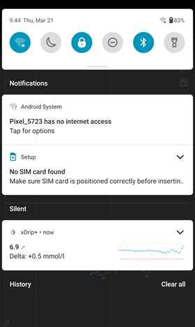
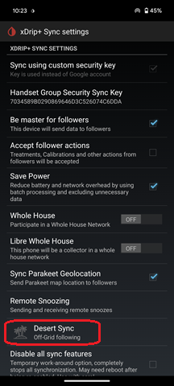
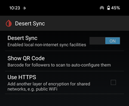
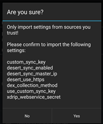

## Desert Sync
[xDrip](../../README.md) >> [Features](../Features_page.md) >> [Follow](../Follow_page.md) >> Follow with no internet access  
  
You can use xDrip to follow even if there is no access to the internet (internet desert).  You however need to be close enough to each other so that the follower can use the WiFi hotspot of the master.  
But, the master does not need to have access to the internet itself.  
For example, you could be camping, or on a motorcycle ride together, away from any cell service or WiFi.  
   

---  

#### **How to set up**  
Enable WiFi hotspot on the master.  
Set up WiFi on the follower to access the hotspot WiFi of the master.  You will need the WiFi hotspot password from the master phone.  
In the following image, you can see my follower that has no sim card or WiFi access, but is connected to the master.  It also shows that the master itself has no internet access.  
  
  
On the master phone, go to the sync settings page and the `Desert Sync` page from there.  
  
  
Enable `Desert Sync`.  Then, tap on `Show QR code`.  
  

In the follower xDrip, tap on `Auto configure` under `Settings` and scan the QR code shown on the mater.  
You will be asked to approve importing settings.  Approve it.  
  
  
