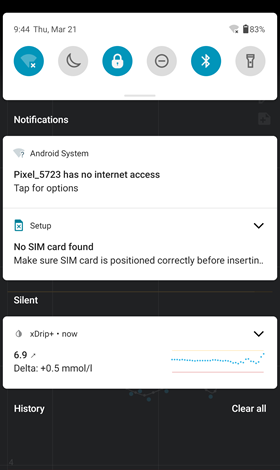
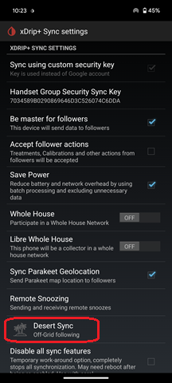
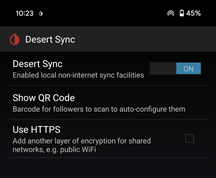
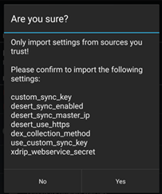

# Desert Sync
[xDrip](../../) >> [Features](../Features_page.md) >> [Follow](../Follow_page.md) >> Follow with no internet access  
  
You can use xDrip to follow even without internet access (internet desert). However, the follower must be close enough to connect to the master’s hotspot.  
The master itself does not need internet access.  
For example, you could be camping or on a motorcycle ride together, far from any cell service or WiFi.  
   

---  

#### **How to set up**  
1- **Enable WiFi hotspot or Bluetooth tethering** on the master device.  
  
2- On the follower device, connect to the master’s WiFi hotspot or pair via Bluetooth.  
- Ensure the follower can access the internet when the master can.  
- If using WiFi, you will need the hotspot password from the master’s phone.
  
In the following image, you can see a follower device with no SIM card or WiFi access, connected to the master. The master itself also has no internet access.   
  
  
3- On the master phone, go to the sync settings page and enable **"Be master for followers"**.  
  
  
4- Go to `Desert Sync`.  Enable **"Desert Sync"** and tap **"Show QR code"**.  
  
   
  
5- On the follower device, open xDrip and go to `Settings` > `Auto configure` and scan the QR code displayed on the master.  
Approve the prompt to import settings.  
  
   

---  

#### **Reference**  
[xDrip issue](https://github.com/NightscoutFoundation/xDrip/issues/558#issuecomment-416405666)  
  
