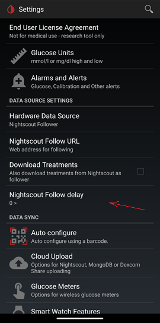
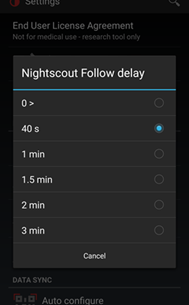
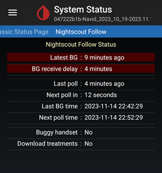

## Follow Nightscout
[xDrip](../../README.md) >> [Features](../Features_page.md) >> [Follow](../Follow_page.md) >> Nightscout  
  
You can easily set up xDrip to follow Nightscout by configuring the following settings:  
Select Nightscout Follower as the Data Source.  

Under [hardware data source](../HardwareDataSource.md), select `Nightscout Follower`.  

Go to `Settings` &#8722;> `Nightscout Follow URL` and enter the Nightscout Follow URL, based on the `AUTH_DEFAULT_ROLES` variable setting:  
  
| AUTH_DEFAULT_ROLES | Nightscout Follow URL |  
| ------------------ | --------------------- |  
| readable | https://hostname |  
| denied | https://API_SECRET@hostname   &ensp;&ensp;&ensp;&ensp;&ensp;&ensp;&ensp;&ensp; or   https://Token@hostname |  
  
* hostname: The address of the Nightscout site, excluding https:// at the beginning.  
* API_SECRET: The password used by the uploader to upload to Nightscout.  
* Token: A token that a Nightscout user can create to allow you to follow without disclosing their password.  
   
  
---  

#### **Wake delay**  
When Nightscout follower is chosen as the xDrip hardware data source, xDrip performs a maximum of 2 attempts to read from Nightscout.  
If after two attempts, xDrip fails to get a new reading, it assumes that the master may be disconnected from the internet, and goes back to sleep.  There is no way for the follower to confirm if the master is disconnected.  Therefore, it is the only reasonable course of action to avoid wasting battery and data.  

However, it is possible that the master experiences a delay in uploading to Nightscout.  It is possible that when the follower attempts to read from Nightscout, the master still has not uploaded to Nightscout.  

There is a setting you can use to manually delay when xDrip reads from Nightscout, as a Nightscout follower, to remedy this situation.  
  

    

If you delay the Nightscout follower this way such that when it attempts to read from Nightscout, the master has already uploaded, your follower will succeed to read instead of going to sleep and getting the same reading with a few minutes of delay.  

**Do I need this?**   
If you are happy with how Nightscout follower works for you, no, you can keep everything as is.  

**What is the benefit?**  
It can decrease the delay from the time the person you are following has a new reading until you can see it on your follower.  
If you look at the Nightscout follow status page and see a delay in red as shown below, it means that you may benefit from this.  
  

**What if I don't change anything?**  
If your master experiences a delay and you don't adjust the follower delay, your follower will still receive all readings.  It will just receiver every reading with some delay.  The delay could be a few up to 5 minutes.  

**What is the best setting?**  
The majority can leave this at the default 0 setting.  
However, if you see a delay on the Nightscout follow status page, try different values.  Choose the shortest delay that removes the red delay note from the status page.  
  
