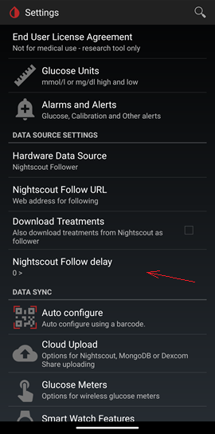
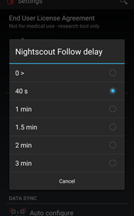
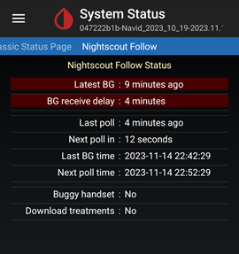

## Follow Nightscout
[xDrip](../../README.md) >> [Features](../Features_page.md) >> [Follow](../Follow_page.md) >> Nightscout  
  
You can easily set up xDrip to follow Nightscout by configuring the following settings:  
  
Select `Nightscout Follower` as the [Data Source](../HardwareDataSource.md).  
  
Go to `Settings` &#8722;> `Nightscout Follow URL` and enter the Nightscout Follow URL, based on the `AUTH_DEFAULT_ROLES` variable setting:  
  
| AUTH_DEFAULT_ROLES | Nightscout Follow URL | Browser URL |  
| ------------------ | --------------------- | ----------- |  
| readable | https://hostname | https://hostname |  
| denied | https://API_SECRET@hostname   &ensp;&ensp;&ensp;&ensp;&ensp;&ensp;&ensp;&ensp; or   https://Token@hostname | https://API_SECRET@hostname   &ensp;&ensp;&ensp;&ensp;&ensp;&ensp;&ensp;&ensp; or   https://Token@hostname |  
  
* hostname: The address of the Nightscout site, excluding https:// at the beginning.  
* API_SECRET: The password used by the uploader to upload to Nightscout.  
* Token: A token [created](../Nightscout/Tokens.md) by a Nightscout master, allowing you to follow without requiring their password.  
   
  
---  

#### **Configure Wake Delay**  
As a Nightscout Follower, xDrip will attempt to read data from Nightscout twice.  If it cannot retrieve a new reading after two attempts, it will assume the master device is disconnected and go to sleep to conserve battery and data.  
Delays in the master device uploading data to Nightscout may cause failed attempts.  
  
To address this:  
Set a delay to allow xDrip to wait before reading from Nightscout. This accounts for any upload delays and ensures xDrip retrieves the latest data instead of going to sleep with outdated information.  
  
  
  
  
**Do you need this setting?**   
No changes are needed if you’re satisfied with how the Nightscout follower currently works.  
  
**Benefits of adjusting delay**  
Adjusting the delay can reduce the time it takes for new readings from the master to appear on your follower. If you see a red delay indicator on the Nightscout follow status page, adjusting the delay setting may help.  
  
  
**What if you don’t change anything?**  
Your follower will still receive all readings, but there might be a delay of up to 5 minutes, depending on the master’s upload time.    
  
**Best setting for delay**  
Most users can keep the default setting of 0.  If you notice delays, experiment with different values to find the smallest value that eliminates the red delay indicator.  
  
