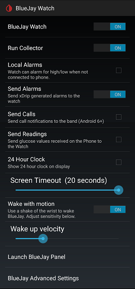
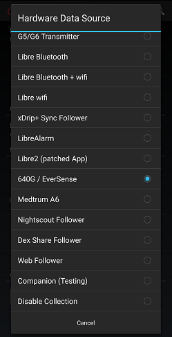
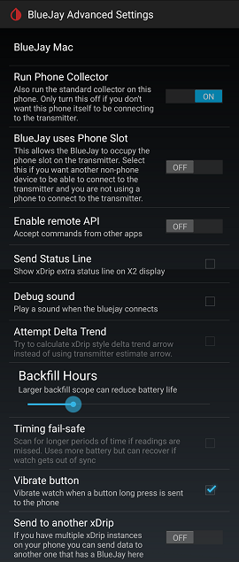
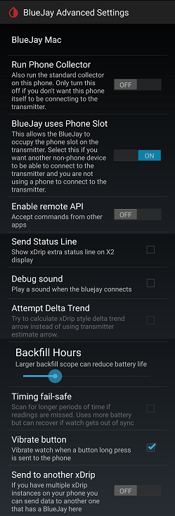

## BlueJay Follower  
August 25, 2022 

You can have xDrip show readings collected by your BlueJay.  Since BlueJay and xDrip communicate using Bluetooth, your phone and BlueJay need to be close for this to work.  It will not work over the internet.  
You need to link BlueJay to xDrip using the xDrip BlueJay Admin page.  
The following image shows the xDrip BlueJay settings page.  
  

You have two options depending on which G6 transmitter slot BlueJay can use.  The following presents both options.  
  
### BluJay can use the medical (non-phone) slot  
Bluejay, by default, uses the medical slot of a G6.  If you have another device or app occupying the phone slot and cannot use xDrip to collect from your G6, you can set up xDrip to receive readings from your Bluejay.  
  
You first need to set up your Bluejay as an independent collector.  
Then, you should select "640G / EverSense" as the xDrip hardware data source.  
  
  
The following image shows the xDrip BlueJay Advanced Settings page.    
  
  
### BlueJay can use the phone slot  
In this case, BlueJay is forced to use the phone slot.  You need to start from default settings where xDrip is set to collect from the phone slot with the correct transmitter ID entered in xDrip.  Then, on the xDrip Advanced BlueJay Settings page, you need to disable phone collector and enable "BlueJay uses Phone slot" as shown in the following image.  
  
  
