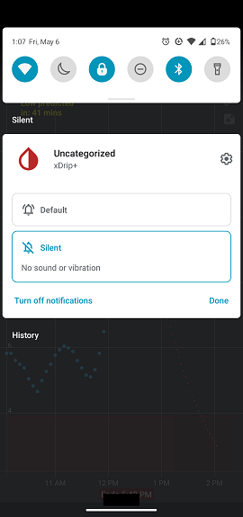

## Why do I get a notification for each reading?  
  
xDrip needs its persistent notification to be active to work properly.  
But, you can silence it.  

Pull down from the top of screen to see the current notifications.  
Long press the xDrip notification.  Make it silent as shown below.  
  
