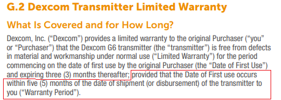

## G6 Warranty  
  
A transmitter is under warranty if two conditions are satisfied:  

1. The second date on the transmitter box was not passed when you started using it (for a use-by date) or when you received it (for ship-by date).  
    
2. You started using the transmitter less than 5 months after receiving it.  
  
  
The warranty covers proper operation for an uninterrupted period of 90 days.  
It's not a good idea to purchase too many transmitters.  The battery ages anyway, and the warranty may expire before you get to use the transmitter.  
