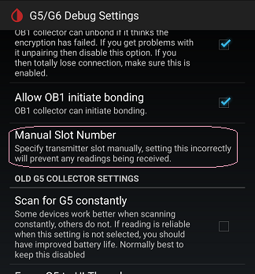

## G6 Bluetooth Communications Slots  
  
A G6 transmitter has 2 slots.  That's why you can use a t:slim pump and also see your readings in xDrip.  Or, you can use both the Dexcom receiver and xDrip at the same time.  

You can change the slot that xDrip uses.  
By default, xDrip is on slot 2.  t:slim pump is  on slot 1.  The Decxcom receiver is also on slot 1.  

If you want to change the slot number xDrip uses, you first need to enable [engineering mode](./Engineering-Mode.md).  
Then, if you go to Settings &#8722;> G5/G6 Debug Settings, you will see a new setting right after "Allow OB1 initial bonding".  
  

It is called "Manual Slot Number".  To force xDrip to use the non-default slot number, set that to 1.  
If you disable engineering mode, it will use the default setting.  
