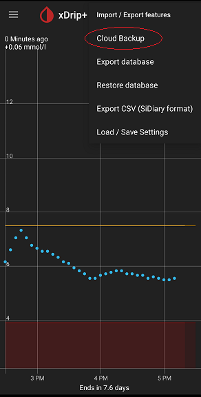

## Google Cloud Backup
[xDrip](../README.md) >> [Backup](./Backup) >> [Google Cloud](GoogleCloud)  
  
To access Google Cloud functions, tap on "Cloud Backup" from the top right menu button on the main screen, under Import/ Export features.  
  
  
You need to select the backup location and sign in to your Google account.  
Then, you have the choice of enabling automatic backups or manually making backups.  
