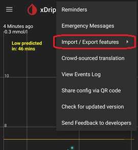
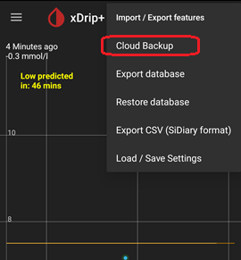
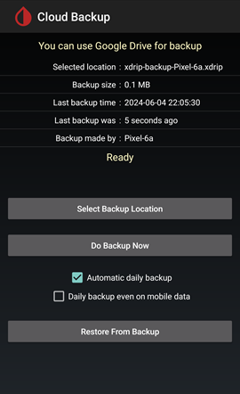
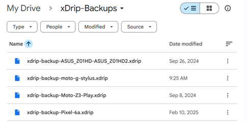
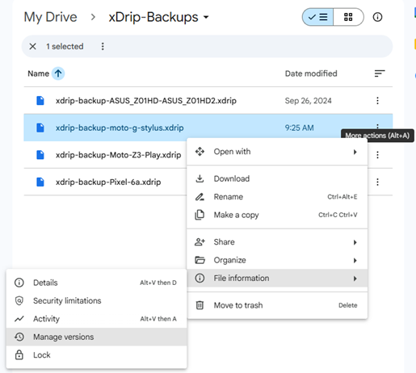
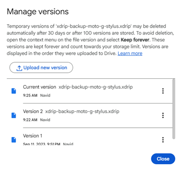

  
# Google Drive Backup
[xDrip](../) >> [Features](./Features_page.md) >> [Backup](./Backup.md) >> Google Drive Backup  
  
To access Google Drive functions, tap the `Import /Export features` option from the 3-dot menu in the top-right corner of the main screen.  
  
  
Then, tap `Cloud Backup` from the sub-menu.  
  
  
Note: Google Drive backup may not function if you are using a version of xDrip from a repository other than the [official NightscoutFoundation repository](https://github.com/NightscoutFoundation/xDrip).  
In that case, you must use the [legacy backup](./Backup-Database) method.  
   
  
---  
  
#### **Setup**
To get started, select the backup location and sign in to your Google account.  
Then, you have the choice of enabling automatic backups or manually making backups.  
Settings and database are backed up in a single compressed encrypted file.  

You can enable the optional automatic daily backup.  
  
The image below shows an example of the Google Drive backup interface:  
  
   
  
---  
  
#### **Backups on Google Drive**  
For each phone, you will see only one file in your Google Drive:  
  
  
When you create a new backup, it is added as a revision to the existing file rather than creating a new one.  
When you restore a backup, xDrip automatically uses the most recent revision.  
You can manage specific versions by selecting "File information" > "Manage versions" from the Google Drive three-dot menu.  
  
  
  
  
Important: Google Drive keeps temporary versions for 30 days only, unless you manually change the setting for a specific revision to "Keep forever."  
  
