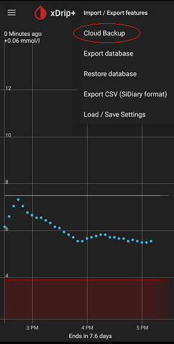

## Google Drive Backup
[xDrip](../README.md) >> [Features](./Features_page.md) >> [Backup](./Backup.md) >> Google Drive Backup  
  
To access the Google Drive functions, tap on `Import /Export features` from the top right (3-dot) menu button on the main screen.  Then, tap on `Cloud Backup` from the sub-menu.  
  
  
You need to select the backup location and sign in to your Google account.  
Then, you have the choice of enabling automatic backups or manually making backups.  
Settings and database are backed up in a single compressed encrypted file.  

You can enable the optional automatic daily backup.  
  
The following image shows an example what you may see on the Google Drive backup page.  
  
  
